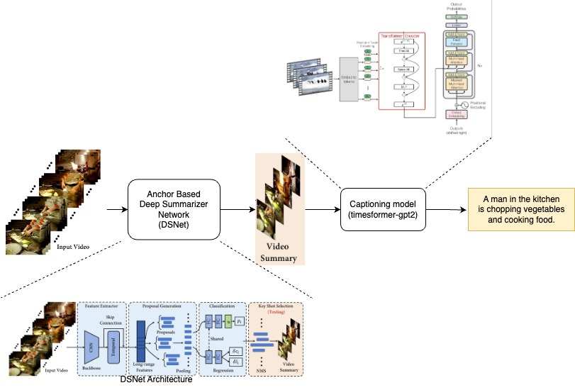

# Video-Summarization-and-Captioning

## Objective : 
Objective of the project was to develop a comprehensive Video Summarization and Captioning framework. This framework is designed to automatically generate concise summaries and descriptive captions for video content, streamlining the processing of extensive video data.
We utilized two datasets in our study: TVSum and SumMe. TVSum encompasses a diverse collection of 50 videos, providing a broad spectrum of content. SumMe, with its 25 distinct videos, offers a variety of personal and event-focused content.
Our approach begins with inputting a video from these datasets into DSNet, an anchor-based deep summarizer network. DSNet processes this video, distilling it into a condensed summary that captures the key moments. This summary is then inputted into a Timesformer GPT-2 model, which crafts a caption encapsulating the core narrative of the summarized video.
The anchor-based method generates temporal interest proposals, which help in determining and localizing key video content. DSNet is distinct for leveraging temporal consistency in its summarization process.



## Getting Started

### To Run the Summarizer network
Create a virtual environment with python 3.6

```sh
conda create --name VSC python=3.6
conda activate VSC
```

Install python dependencies.

```sh
pip install -r requirements.txt
```
### To Run the Captioning network
Create a virtual environment with python 3.11

```sh
conda create --name Vid-Cap python=3.11
conda activate Vid-Cap
```

Install python dependencies.

```sh
pip install -r requirements-captioning.txt
```

## Datasets Preparation

Download the pre-processed datasets into `datasets/` folder, including [TVSum](https://github.com/yalesong/tvsum), [SumMe](https://gyglim.github.io/me/vsum/index.html)

```sh
mkdir -p datasets/ && cd datasets/
wget https://www.dropbox.com/s/tdknvkpz1jp6iuz/dsnet_datasets.zip
unzip dsnet_datasets.zip
```

## Training

#### Anchor-based

To train anchor-based attention model on TVSum and SumMe datasets with canonical settings, run

```sh
python train.py anchor-based --model-dir ../models/ab_basic --splits ../splits/tvsum.yml ../splits/summe.yml
```

## Evaluation

To evaluate the anchor-based models, run

```sh
python evaluate.py anchor-based --model-dir ../models/ab_basic/ --splits ../splits/tvsum.yml ../splits/summe.yml
```

## Using Custom Videos

### Inference

To predict the summary of a raw video, use `infer.py`. For example, run

```sh
python infer.py anchor-based --ckpt-path ../models/custom/checkpoint/custom.yml.0.pt \
  --source ../custom_data/videos/EE-bNr36nyA.mp4 --save-path ./output.mp4
```

### Captioning

To predict the summary of a raw video, use `caption.py`. For example, run

```sh
python caption.py --video_path ./St-Maarten-Landing-output.mp4 --output_path St-Maarten-Landing-caption.txt
```

## Contributors
1. Anisha Bhatnagar (ab10945@nyu.edu)
2. Tanya Ojha (to2141@nyu.edu)

## References
1. [DSNet: A Flexible Detect-to-Summarize Network for Video Summarization](https://github.com/li-plus/DSNet/tree/master)
2. [TimesFormer-GPT2 for video captioning](https://huggingface.co/Neleac/timesformer-gpt2-video-captioning)


